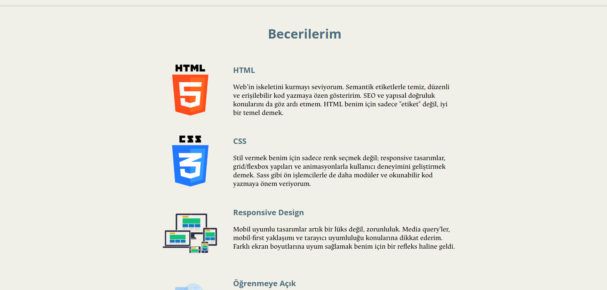
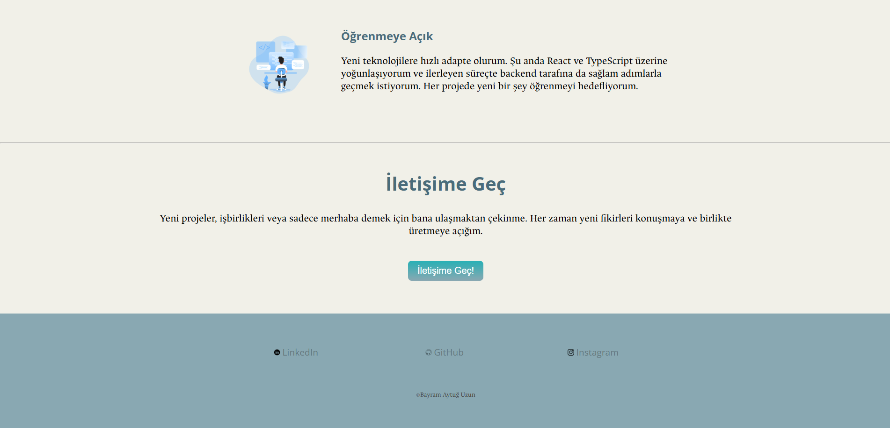
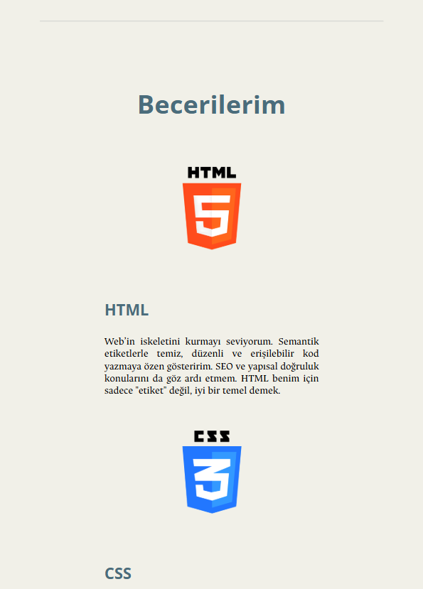
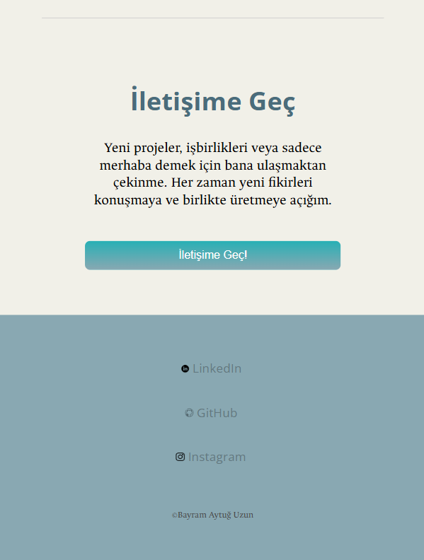

# Capstone Personal Website

Responsive kişisel tanıtım sayfası.  
HTML ve CSS kullanılarak geliştirildi.

## ✨ Özellikler

- Responsive tasarım (mobil uyumlu)
- Flexbox & Grid kullanımı
- Kişisel bilgi, beceri ve iletişim bölümleri
- Basit ama modern görünüm

## 📸 Ekran Görüntüsü

## 🔗 Canlı Link

GitHub Pages ile yayında: [Tıkla git!](https://aytugzn.github.io/capstone-personal-website)

